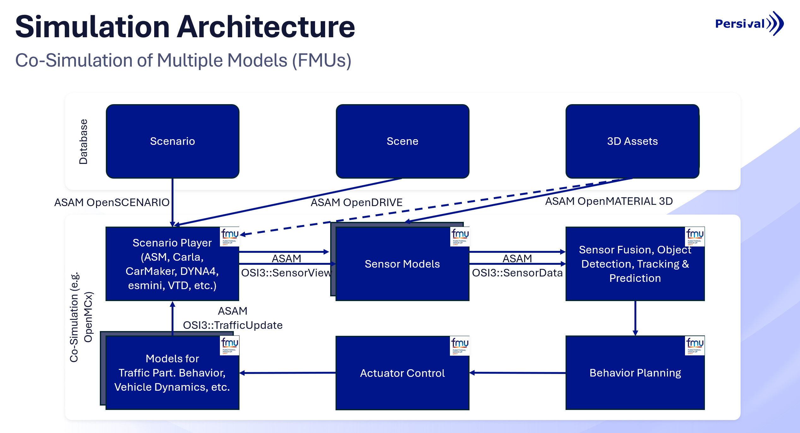

# Standardized Co-Simulation Demo

This repository demonstrates how to set up and run advanced co-simulation workflows for automotive and mobility applications using OpenMCx and esmini together with physical perception sensor models, while leveraging the ASAM OpenX standards for interoperability.

- **Co-Simulation Setup with OpenMCx**:
Learn how to configure and orchestrate multi-domain simulations using OpenMCx as the backbone for distributed simulation environments.
The co-simulation system definitions are implemented in the [SSP standard](https://ssp-standard.org/).

- **Integrating esmini**:
Explore how [esmini](https://github.com/esmini/esmini), a lightweight ASAM OpenSCENARIO player, can be integrated into co-simulation setups for scenario execution and visualization using the [FMI standard](https://fmi-standard.org/) and ASAM OSI.
It is packaged as a Functional Mock-up Unit (FMU) for seamless integration.

- **Showcasing ASAM OpenX Standards**
Understand how [OpenDRIVE](https://www.asam.net/standards/detail/opendrive/), [OpenSCENARIO XML](https://www.asam.net/standards/detail/openscenario-xml/), [OpenMATERIAL 3D](https://www.asam.net/standards/detail/openmaterial/), and [OSI](https://www.asam.net/standards/detail/osi/) work together to create a consistent and standardized simulation ecosystem.
  - OpenDRIVE: Road network representation
  - OpenSCENARIO XML: Scenario definition and behavior modeling
  - OpenMATERIAL 3D: 3D geometries and material properties for realistic wavelength-dependent rendering
  - OSI (Open Simulation Interface): Sensor and environment data exchange

- **Physical Perception Sensor Simulation**:
Use sensor models (e.g., lidar, radar, camera) with ray tracing as functional mock-up units with standardized interfaces for perception testing and validation in virtual environments.
The given sensor model examples work with the [Persival Sensor Model Development Library (SMDL)](https://www.persival.de/smdl) as a backend.

## How it works

The entire co-simulation setup comprises multiple FMUs in a standardized packaging with standardized interfaces.
Each module or model of the system is packaged as an FMU according to the FMI standard.
Which models are used and how they are connected is defined in a system structure definition (SSD) file according to the SSP standard, see folder `ssds/`.
The co-simulation is orchestrated by the OpenMCx co-simulation framework, which loads the SSD file and manages the communication between the different FMUs during simulation runtime.

As an exemplary scenario player, the esmini FMU is used to execute scenarios defined in ASAM OpenSCENARIO XML format.
The esmini FMU has the FMI parameter `xosc_path` to specify the scenario file to be executed.
The submodule `asam-openx-assets` contains example scenarios and assets in ASAM OpenX formats (OpenDRIVE, OpenSCENARIO XML, OpenMATERIAL 3D) that can be used with the esmini FMU.
The OpenSCENARIO file references an OpenDRIVE road network as well as OpenMATERIAL 3D assets for the environment and moving objects.
This information is processed by esmini during simulation runtime.
Every simulation time step, the esmini FMU provides the current state of all simulated objects and the environment via an ASAM OSI interface.

The ASAM OSI SensorView message is used by a sensor model to generate and sequentially update a 3D representation of the environment from the perspective of the simulated sensors.
The provided 3D geometries and wavelength-dependent material properties from the OpenMATERIAL 3D assets are used by the sensor model for physically accurate ray tracing.
A resulting sensor output (e.g. point cloud for lidar) is generated by the sensor model and provided as an ASAM OSI SensorData message.
This message can either be used in subsequent processing FMUs (e.g. perception algorithms) or stored in an ASAM OSI trace file by an OSI trace file writer FMU for later analysis and visualization.
A trace file writer FMU is included in the co-simulation setup to store all relevant simulation data in an ASAM OSI trace file for later analysis and visualization.



## Build

This demo repository has only been tested on Ubuntu >= 20.04.
Follow these steps to build all components:

1. Clone the repository with submodules

    ```bash
    git clone https://github.com/github.com/Persival-GmbH/standardized-co-simulation-demo.git --recurse-submodules
    cd standardized-co-simulation-demo
    ```
   If you did not directly clone with submodules, they can also be initialized and updated after cloning with:

    ```bash
    git submodule update --init --recursive
    ```

2. Install dependencies

  - Protobuf with static linking

    ```bash
    wget https://github.com/protocolbuffers/protobuf/releases/download/v21.12/protobuf-all-21.12.tar.gz
    tar -xzf protobuf-all-21.12.tar.gz
    cd protobuf-21.12/
    ./configure --disable-shared CXXFLAGS="-fPIC"
    make -j12
    sudo make install
    sudo ldconfig
    ```
  
  - When using a sensor model: An Nvidia RTX GPU with an Nvidia driver >= 535 is required

3. Build all components with build script in the `standardized-co-simulation-demo` folder

    ```bash
    ./build.sh
    ```

4. Create a symlink to /opt. This will make file handling a lot easier, since absolute paths can be used instead of relative paths.

    ```bash
    ln -s $(pwd) /opt/standardized-co-simulation-demo
    ```
   
    Depending on your system configuration, you might need to use `sudo` for this command.

## Usage

Run a co-simulation with the co-simulation framework OpenMCx.
Choose one of the pre-defined system structure definitions in the `ssds` folder.

As a minimal example, run the `esmini-tracefilewriter` example.
It will load the German Highway Demo scenario from the ASAM OpenX Assets and store the simulation result as an ASAM OSI SensorView trace file.
This trace file will contain the ground truth moving objects including model references to ASAM OpenMATERIAL 3D asset files.

```bash
./tools/openmcx/install/openmcx ./ssds/esmini-tracefilewriter.ssd
```

For a more advanced example including a physical lidar model, run the `esmini-lidar_model-tracefilewriter` system structure definition.

```bash
./tools/openmcx/install/openmcx ./ssds/esmini-lidar_32layer-tracefilewriter.ssd
```

The resulting ASAM OSI trace files will be written to the `./simulation_output` folder by default.
This can be changed by modifying the `trace_path` parameter of the sl-5-6-osi-trace-file-writer fmu in the respective ssd file.

## Visualize the Simulated Data

For visualizing the generated ASAM OSI trace files in combination with the entire 3D environment in ASAM OpenMATERIAL 3D format, we recommend to use the Persival Simspector.
You can download a free 30-day trial version from the Persival website: https://www.persival.de/simspector.


